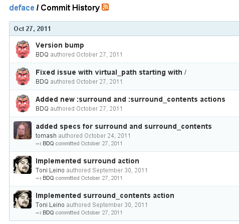

!SLIDE

# Deface

!SLIDE code
    @@@ Ruby
    Deface::Override.new(
      :virtual_path  => "shared/_products",
      :insert_bottom => "#products_list_item",
      :text => '

                  <%= product.on_hand %> pcs
                
',
      :name    => "products_list_item_availability")

!SLIDE bullets

* while rendering "shared/\_products"
* get the element with id "products\_list\_item"
* and at the bottom of it
* insert the code showing in-stock amounts

!SLIDE bullets

* https://github.com/railsdog/deface
* http://deface.heroku.com/

!SLIDE bullets

## view customization is now 20% cooler

* ✓ easy to maintain and update
* ✓ only the required code
* ✓ great docs
* ✓ zero-bullshit

!SLIDE

# used outside of Spree?

## any engine!

"I've tested Deface with Refinery a while ago and it worked no problem. It's really just a matter of including the gem and creating the overrides in the relevant app/overrides directory."
-- Brian Quinn, autor Deface

!SLIDE

### "this engine view is OK, but I need partial caching here"

!SLIDE code
    @@@ Ruby
    Deface::Override.new(
      :virtual_path => "posts/index",  
      :surround => "ul.posts",
      :text => "<% cache('foo') do %>
                  <%= render_original %>
                <% end %>",
      :name => "Posts#index")

