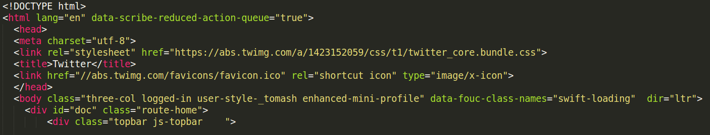

# Wprowadzenie do aplikacji webowych

### Tomasz Stachewicz

@_tomash

---

# Dziś tworzymy!

---

# Co to jest aplikacja webowa?

---

<section data-background="images/rocket1.jpg">
  <h1 style="background-color: rgba(256,256,256,0.8); padding-bottom: 40px;">Mniej złożona niż rakieta kosmiczna!</h1>
</section>

---

<section data-background="images/LangeZeitwerk20.jpg">
  <h1 style="background-color: rgba(256,256,256,0.8); padding-bottom: 40px;">Ale wciąż ma sporo elementów.</h1>
</section>

---

<section data-background="images/khalifa.jpg">
  <h1 style="background-color: rgba(256,256,256,0.8); padding-bottom: 40px;">Programowanie to inżynieria</h1>
</section>

---

<section data-background="images/scream.jpg">
  <h1 style="background-color: rgba(256,256,256,0.8); padding-bottom: 40px;">Trochę też sztuka</h1>
</section>

---

<section data-background="images/citroen_hdw.jpg">
  <h1 style="background-color: rgba(256,256,256,0.8); padding-bottom: 40px;">I dużo frajdy</h1>
</section>

---

# Czym jest aplikacja webowa?

---

<section data-background="images/chrome_home.png">
  <h1 style="background-color: rgba(256,256,256,0.8); padding-bottom: 40px;">Potrafi ją otworzyć przeglądarka</h1>
</section>

---

<section data-background="images/server_racks.jpg">
  <h1 style="background-color: rgba(256,256,256,0.8); padding-bottom: 40px;">Działa na serwerze</h1>
</section>

---

<section data-background="images/facebook_screenshot.png">
  <h1 style="background-color: rgba(256,256,256,0.8); padding-bottom: 40px;">Jest dynamiczna</h1>
</section>

---

# Kim jest "klient" a kim jest "serwer"?

---

## https://twitter.com/

## -> "żądanie" (request)

---

# "odpowiedź" (response)

---

# Z czego składa się aplikacja webowa?

---

## Frontend: wszystko to, co trafia do przeglądarki.

### HTML, CSS, Javascript

---

# HTML: struktura i zawartość

---

# CSS: określenie wyglądu

---

<section data-background="images/railsgirls_nocss.png">
  <h1 style="background-color: rgba(256,256,256,0.8); padding-bottom: 40px;">Bez CSS</h1>
</section>

---

<section data-background="images/railsgirls_css.png">
  <h1 style="background-color: rgba(256,256,256,0.8); padding-bottom: 40px;">Po dodaniu CSS</h1>
</section>

---

# Javascript: nieważne

---

# Backend: wszystko co **nie trafia** do przeglądarki

---

<section data-background="images/fight_club.jpg">
  <h1 style="background-color: rgba(256,256,256,0.8); padding-bottom: 40px;">Czyli wszystko to, co dzieje się w serwerowni</h1>
</section>

---

# Infrastruktura, dane, logika

--- 

<section data-background="images/server_racks.jpg">
  <h1 style="background-color: rgba(256,256,256,0.8); padding-bottom: 40px;">Infrastruktura</h1>
</section>

---

# Co może być serwerem?

---

<section data-background="images/hard_disk.jpg">
  <h1 style="background-color: rgba(256,256,256,0.8); padding-bottom: 40px;">Dane</h1>
</section>

---

<section data-background="images/excel_table.png">
  <h1 style="background-color: rgba(256,256,256,0.8); padding-bottom: 40px;">Baza danych: tabelki jak w excelu</h1>
</section>

---

<section data-background="images/keep_calm_code_ruby.png">
  <h1 style="background-color: rgba(256,256,256,0.8); padding-bottom: 40px;">Logika</h1>
</section>

---

# Ruby: język

---

# Rails: framework

---

# Dzięki i bawcie się dobrze!

---

### (pytania?)

---
