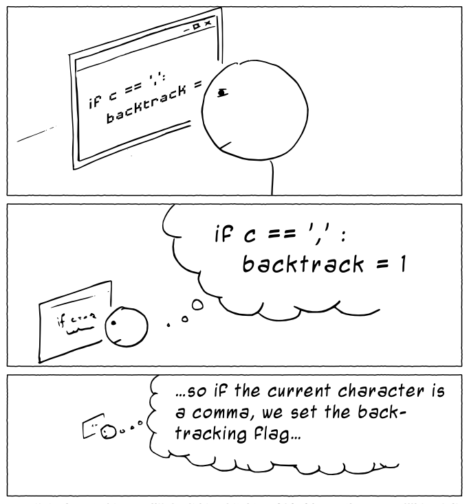
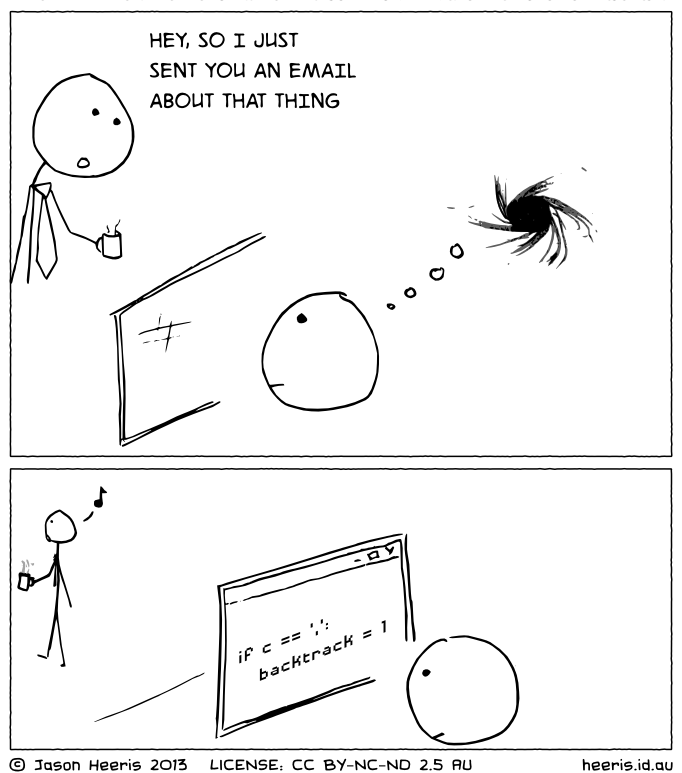

# Środowisko Pracy Programisty

### Tomasz Stachewicz

---

## (i dlaczego 90% branży robi to źle)

---

## Albo: dlaczego nienawidzę openspace'ów i wy też powinniście.

---

## Kiedy ostatnio wymyśliłaś lub stworzyłaś coś ciekawego?

---

## Programowanie jest trudne i wymagające

## między innymi skupienia.

---

# Rozdział pierwszy: Flow

---

---

---

---

## Pamięć krótkotrwała ma kiepską trwałość i pojemność

---

### The Magical Number Seven, Plus or Minus Two: Some Limits on our Capacity for Processing Information

### http://psychclassics.yorku.ca/Miller/

---

### "It can take as much as 23 minutes for the mind to return to the task at hand, according to recent research done at the University of California."

-- http://www.devx.com/DevX/Article/11659

--- 

Based on an analysis of 10,000 programming sessions recorded from 86 programmers using Eclipse and Visual Studio, and a survey of 414 programmers, we found:

* A programmer takes 10-15 minutes to start editing code after resuming work from an interruption.
* When interrupted during an edit of a method, a programmer resumed work in less than a minute only 10 percent of the time.
* A programmer is likely to get just one uninterrupted two-hour session in a day.

-- https://www.gamasutra.com/view/feature/190891/programmer_interrupted.php

---

## Porozmawiajmy o środowisku sprzyjającym skupieniu

---

# Rozdział drugi: Openspace

---

<section data-background="images/obora.jpg">
</section>

---

<section data-background="images/sweatshop-asia.jpg">
</section>

---

<section data-background="images/sweatshop-nike.jpg">
</section>

---

<section data-background="images/openspace-facebook-menlo-park-2.jpg">
</section>

---

<section data-background="images/twitter-san-francisco.jpg">
</section>

---

# Rozdział trzeci: Dźwięki

---

-- https://www.sciencedaily.com/releases/2001/01/010125080258.htm

-- http://chatterblocker.com/whitepapers/conversational_distraction.html

-- https://www.ncbi.nlm.nih.gov/pmc/articles/PMC2669750/

---

# Rozdział czwarty: Wzrok

---

Visual noise, the activity or movement around the edges of an employee’s field of vision, can erode concentration and disrupt analytical thinking or creativity, research shows. While employers have long tried to quiet disruptive sounds in open workspaces, some are now combating visual noise too. The answer could be as low-tech as strategically placed plants or more drab wall colors.

-- https://www.wsj.com/articles/why-you-cant-concentrate-at-work-1494342840

---

In an experiment with Chinese factory workers published in 2012, Ethan Bernstein, an assistant professor of leadership and organizational behavior at Harvard Business School, found teams were 10% to 15% more productive when they worked behind a curtain that shielded them from supervisors’ view. The employees felt freer to experiment with new ways to solve problems and improve efficiency when protected from their bosses’ critical gaze, Dr. Bernstein says.

-- http://journals.sagepub.com/doi/abs/10.1177/0001839212453028

---

# Rozdział piąty: Zdrowie

---

In the Canada Life survey, those employees surveyed who worked in open-plan offices took over 70% more sick days than those who worked from home.

---

While employees who work from home only took an average of 1.8 sick days last year, workers in open plan offices took 3.1 days.

---

# Rozdział szósty: Koszty

---

Mordor: 40zł za m²

Openspace: 2m * 2m = 4m² na osobę

Pokój: 4m * 4m = 16m² na osobę

---

Pensja programisty: 15 000 PLN.

Openspace: 160 PLN.

Pokój: 640 PLN.

Różnica: 480 PLN albo 3,2% pensji.

---

"Teams were 10% to 15% more productive when they worked behind a curtain that shielded them from supervisors’ view"

"A programmer takes 10-15 minutes to start editing code after resuming work from an interruption."

"It can take as much as 23 minutes for the mind to return to the task at hand"

---

## Birthday paradox for openspace:

## kto będzie teraz rozmawiał?

--- 

## Praca z domu nie jest rozwiązaniem

---

## Jest nadzieja!

"The arrival of interruptions is the most destructive thing in our working lives, but open-plan offices are just full of interruptions."

-- 2017, https://www.thememo.com/2017/03/15/twitter-vp-of-europe-bruce-daisley-the-glorious-open-plan-office-dream-is-dead/

---

"I do believe 10x programmers exist, but why bother chasing unicorns when you have the power to 10x your company environment and culture?"

-- https://twitter.com/dhh/status/552126015615401984

---

## Powodzenia w poprawianiu środowisk!

---

Książki

* https://www.amazon.com/Distracted-Erosion-Attention-Coming-Dark/dp/1591026237

* https://www.amazon.com/Making-Software-Really-Works-Believe/dp/0596808321

* https://www.amazon.com/Peopleware-Productive-Projects-Teams-Second/dp/0932633439

---

