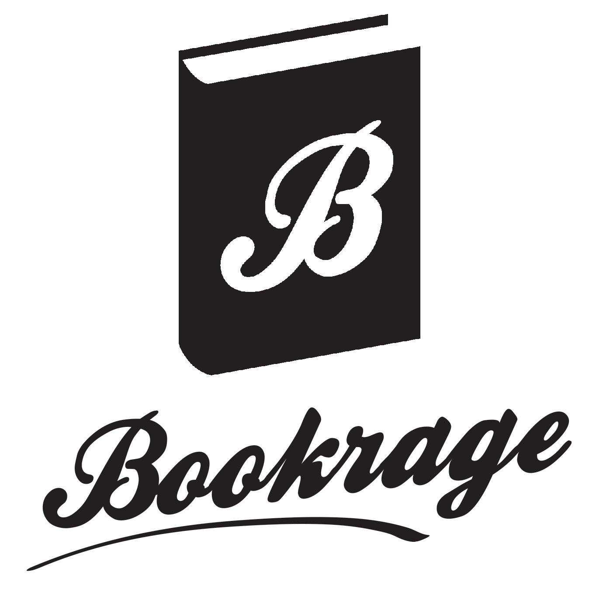

!SLIDE title-slide

# BookRage
## building a (quite) profitable startup
## in about 50 lines of code
### Tomasz "Tomash" Stachewicz

!SLIDE

# ABOUT

## @_tomash
## github.com/tomash

!SLIDE center

 
## developer & owner/founder/"fucking janitor"
## at [Rebased](http://rebased.pl)

!SLIDE center

 
## developer and founder
## at [MusicRage.org](http://musicrage.org)

!SLIDE center

 
## now with 100% more rage in your ebooks
## [BookRage.org](http://musicrage.org)