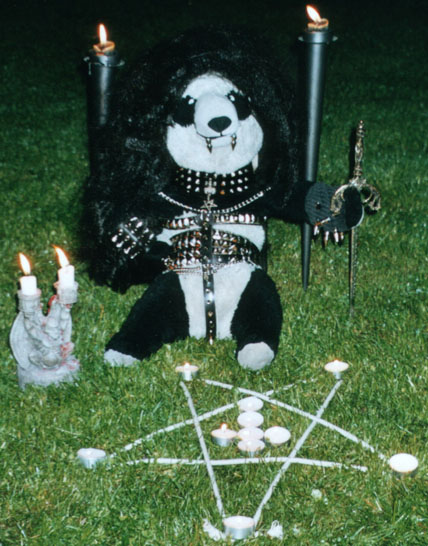

!SLIDE

# Co się działo wczoraj?

!SLIDE

# Koncert TESTAMENT
# w Krakowie!

!SLIDE

# dlatego będziemy
# robić
# metal

!SLIDE

# dlatego będziemy
# PROGRAMOWAĆ
# metal

!SLIDE center

!SLIDE

# Ale najpierw parę słów o Sinatrze

!SLIDE

# "Przeglądarka Internetowa"
### kulawa interpretacja podzbioru
### kilku niedorobionych standardów
### (HTTP, HTML, CSS, JavaScript)

!SLIDE

# Przeglądarka umie dwa słowa HTTP
## GET: pobieram dane!
## POST: wysyłam dane!

!SLIDE

# Sinatra
### najprostszy sposób
### na rozmawianie z przeglądarkami przez HTTP

!SLIDE code

    require 'sinatra'

    get '/' do
      "It works!"
    end

!SLIDE code

    require 'sinatra'

    post '/' do
      # do something with params
      "It works!"
    end

!SLIDE

# Napiszmy metalowy generator Lorem Ipsum

!SLIDE bullets

# Źródła

* http://sinatrarb.com

!SLIDE title-slide

# Dzięki!
# Pytania?