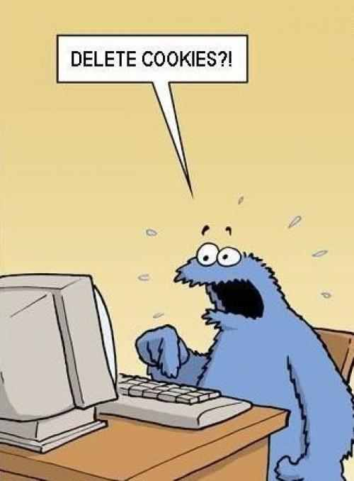
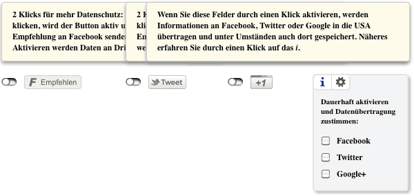
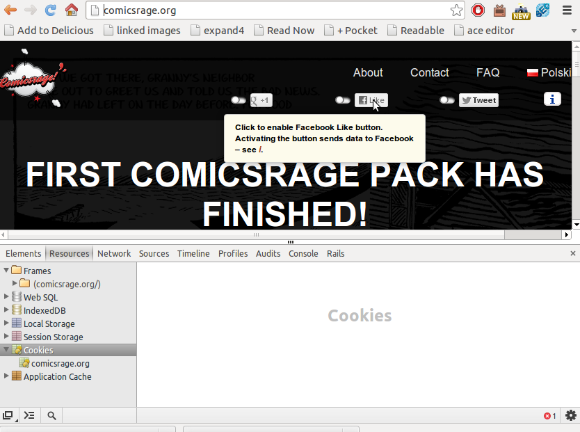

!SLIDE

# Porozmawiajmy o ciasteczkach

!SLIDE center

!SLIDE

# "European cookie law":
## Dyrektywa Parlamentu Europejskiego nr 2009/136/EC
### rekomendacja opisująca duch (ideę) przepisu
### do zaimplementowania w państwach członkowskich

!SLIDE

### 2009/136/EC

Third parties may wish to store information on the equip­ment of a user, or gain access to information already stored, for a number of purposes, ranging from the legiti­mate (such as certain types of cookies) to those involving unwarranted intrusion into the private sphere (such as spy­ware or viruses). It is therefore of paramount importance that users be provided with clear and comprehensive infor­mation when engaging in any activity which could resultin such storage or gaining of access. The methods of pro­viding information and offering the right to refuse should be as user-friendly as possible. Exceptions to the obligation to provide information and offer the right to refuse should be limited to those situations where the technical storage or access is strictly necessary for the legitimate purpose of enabling the use of a specific service explicitly requested by the subscriber or user. Where it is technically possible and effective, in accordance with the relevant provisions of Directive 95/46/EC, the user’s consent to processing maybe expressed by using the appropriate settings of a browser or other application. The enforcement of these require­ments should be made more effective by way of enhanced powers granted to the relevant national authorities.

!SLIDE

# Polska implementacja
## Prawo Telekomunikacyjne
## zmiana ustawą z 16. listopada 2012
## Dziennik Ustaw 2012 Poz. 1445
## interesuje nas artykuł 173

!SLIDE

# "Ta strona używa cookies, korzystając z niej się na to zgadzasz"
## lamerskie
## w kilku krajach UE (np. Polsce) legalne
## w kilku innych (np. Hiszpanii) **nie**legalne

!SLIDE

# Przecież nikt nikogo nie pozwie o wysłanie ciastka z Google Analytics, prawda?

!SLIDE

# http://bit.ly/14x5Vjt

The recently notified AEPD AJ Santiago, my client, which begins disciplinary proceedings against a company that does not meet the Cookies Act. The penalty for breach mild (art. 38.4.g LSSI) Act Cookies (art. 22.2 LSSI) is up 30,000 (39.1.c art LSSI). The penalty could be up to 150,000 € (Art. 39.b LSSI) if the breach was significant (art. 38.3.i LSSI), but not the case.

(wybaczcie Google Translate)

!SLIDE

## TL;DR po prostu nie wysyłaj śledzących ciastek swoim użytkownikom
### (zwłaszcza śledzących dla korzyści zewnętrznego serwisu)

!SLIDE

# Ale jak to?

!SLIDE

# Google Analytics
## fingerprint ("odcisk" przeglądarki) zamiast ciastka
## GA Measurement Protocol
### http://www.humane-tehnologije.si/client-side-google-analytics-without-using-cookies
### http://techpad.co.uk/content.php?sid=205

!SLIDE

# Social Share Privacy
### http://panzi.github.io/SocialSharePrivacy/

!SLIDE center

!SLIDE center

