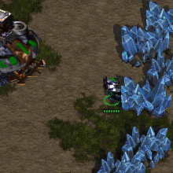
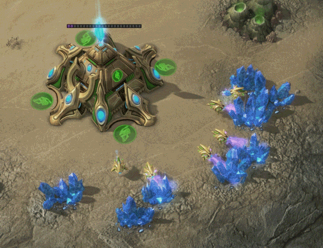

# Postgres 9.6

## Parallelization

Tomasz Stachewicz @ WRUG 15.03.2017

---

# Jak działa Postgres

### i inne bazy danych

---

### operacja sekwencyjna, jeden wątek

---

### marzenie o równoległości

---

# 1. Sequential scans

---

# 2. Aggregation

---

# 3. Joins

---

### Ograniczenia

### wszędzie ograniczenia

---

### (pytania?)

---
